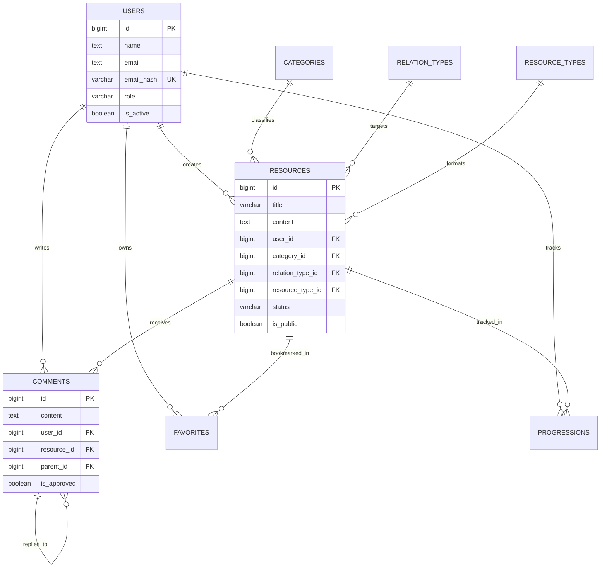
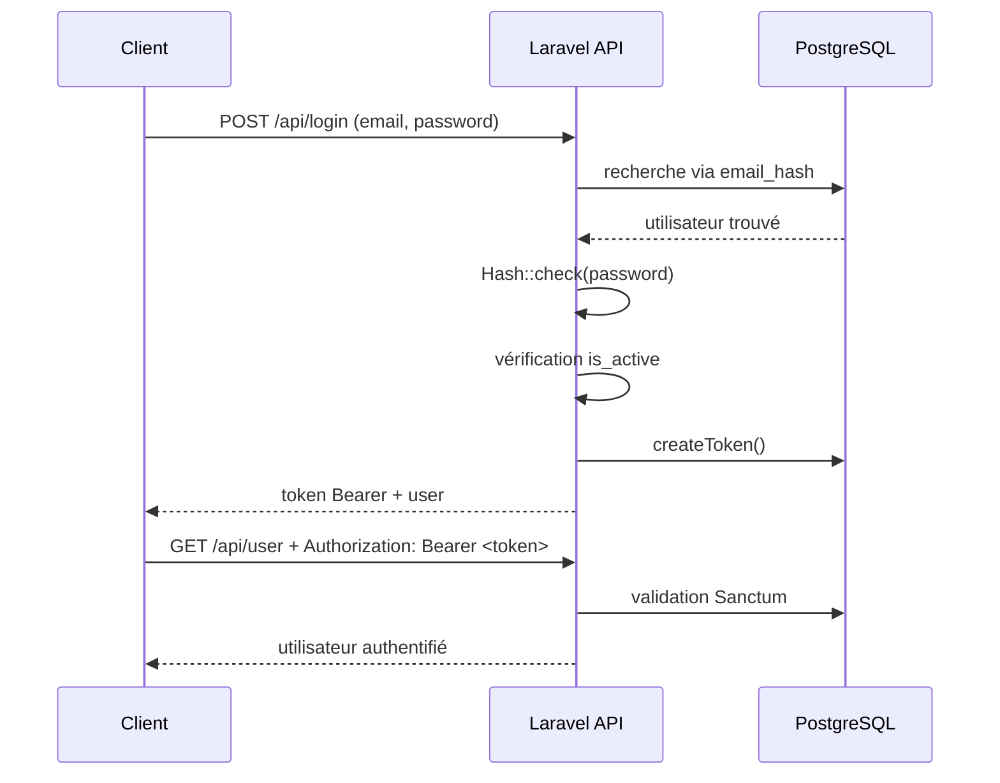

# (RE)Sources Relationnelles

Plateforme de ressources pour l'amélioration des relations entre citoyens.

**Projet CESI — Bloc 2 — Groupe 2**

---

## Stack technique

| Composant | Technologie |
|-----------|------------|
| API | Laravel (PHP) + PostgreSQL |
| Web | Next.js (App Router, TypeScript, Tailwind) |
| Mobile | React Native (Expo) |
| UI partagée | `@app/ui` (React Native Web + NativeWind) |

## Structure du monorepo

```
api/             → Laravel API (backend)
apps/web/        → Next.js (front-office + back-office)
apps/mobile/     → Expo (React Native)
packages/ui/     → Composants UI partagés (web + mobile)
packages/shared/ → Types, hooks, services API partagés
```

## Démarrage rapide

```bash
# Cloner le repo
git clone https://github.com/cesi-2025/grp2-ressources-relationnelles.git
cd grp2-ressources-relationnelles

# Environnement recommandé (API + DB + Adminer + Web)
cp .env.example .env
docker compose up -d --build

# API : http://localhost:8000
# Web : http://localhost:3005 (ou valeur de WEB_PORT dans .env)
# Adminer : http://localhost:8080

# Mobile (hors Docker)
cd apps/mobile && pnpm install && pnpm start
```

> Le workflow local sans Docker reste possible, mais l'équipe utilise désormais principalement Docker pour l'API et le web.

## Environnement Docker (équipe)

Pour éviter les différences de machines entre membres de l'équipe, l'environnement applicatif partagé peut être lancé en conteneurs.

### Services disponibles

- `db` : PostgreSQL 16
- `api` : Laravel (PHP 8.4 + Composer)
- `db_admin` : Adminer (interface web d'administration BDD)
- `web` : Next.js (`pnpm`, hot reload, store pnpm persistant)

### Lancer l'environnement

```bash
cp .env.example .env
docker compose up -d --build
docker compose logs -f api
```

### Ports par défaut

| Service | URL / Port |
|---|---|
| API Laravel | http://localhost:8000 |
| Web Next.js | http://localhost:3005 |
| Adminer | http://localhost:8080 |
| PostgreSQL | localhost:5432 |

> Le port web est piloté par `WEB_PORT` dans `.env`.

### Accéder à l'admin BDD

- URL : `http://localhost:8080`
- System : `PostgreSQL`
- Server : `db`
- Username : `postgres`
- Password : `postgres`
- Database : `ressources_relationnelles`

### Arrêter l'environnement

```bash
docker compose down
```

### Réinitialiser complètement la base

```bash
docker compose down -v
```

### Commandes Laravel dans le conteneur

```bash
docker compose exec api php artisan migrate
docker compose exec api php artisan test
docker compose exec api php artisan route:list
docker compose exec api php artisan db:seed
docker compose exec api php artisan migrate:fresh --seed --force
```

### Commandes web dans le conteneur

```bash
docker compose logs -f web
docker compose exec web pnpm lint
```

### Travail en parallèle dans le monorepo

- Le backend et le web peuvent tourner ensemble en Docker (`api` + `db` + `db_admin` + `web`).
- Le mobile reste lancé localement (`pnpm start`) pour Expo.
- Les packages `packages/ui` et `packages/shared` restent partagés via le monorepo, sans changer le workflow Git.

### Données de démonstration

Le seeding courant permet de reconstruire un environnement QA cohérent :

- `10` utilisateurs de démonstration (tous rôles)
- `20` ressources
- `15` commentaires

Comptes principaux de démo (mot de passe : `password123`) :

| Email | Rôle |
|---|---|
| `superadmin@ressources.local` | super_admin |
| `admin1@ressources.local` | admin |
| `admin2@ressources.local` | admin |
| `moderator1@ressources.local` | moderator |
| `moderator2@ressources.local` | moderator |
| `citizen1@ressources.local` | citizen |
| `citizen2@ressources.local` | citizen |
| `citizen3@ressources.local` | citizen |
| `citizen4@ressources.local` | citizen |
| `citizen5@ressources.local` | citizen |

---

## Chapitres backend & sécurité

Cette section sert de base au document technique demandé pour le backend Laravel. Elle synthétise l'architecture API REST, le modèle de données, les mécanismes d'authentification et les mesures de sécurité/RGPD déjà implémentées.

### 1. API REST : routes, controllers, validation

Le backend est construit autour d'une API REST JSON avec Laravel 11. Les routes sont centralisées dans [api/routes/api.php](api/routes/api.php) et organisées par domaines fonctionnels.

#### Découpage fonctionnel

| Domaine | Contrôleur | Responsabilité principale |
|---|---|---|
| Authentification | `AuthController` | inscription, connexion, déconnexion, profil, anonymisation de compte |
| Ressources | `ResourceController` | listing public, détail public, création, mise à jour |
| Catégories | `CategoryController` | exposition des catégories |
| Interactions | `CommentController`, `FavoriteController`, `ProgressionController` | commentaires, favoris, progression utilisateur |
| Administration | `AdminController` | statistiques, suspension de ressource |
| Modération | `ModerationController` | validation de ressources, approbation/suppression de commentaires |
| Super-admin | `SuperAdminController` | création de comptes privilégiés |

#### Principes d'implémentation

- toutes les réponses API sont forcées en JSON ;
- les endpoints publics exposent uniquement les ressources `published` et `is_public=true` ;
- les écritures passent par des `FormRequest` dédiées pour la validation ;
- les règles d'autorisation sont réparties entre middleware de rôle et policies ;
- les tests feature valident les cas métier principaux et les accès interdits.

#### Validation des entrées

Les validations sont portées par des classes dédiées dans `api/app/Http/Requests` :

- `RegisterRequest` et `LoginRequest` pour l'authentification ;
- `StoreResourceRequest` et `UpdateResourceRequest` pour les ressources ;
- `CommentRequest` pour les commentaires.

Une sanitization centralisée est appliquée avant validation :

- `trim()` sur les champs texte ;
- suppression des balises HTML (`strip_tags`) ;
- normalisation des emails en minuscules ;
- génération d'un `email_hash` pour les recherches d'authentification.

#### Organisation des routes

| Type de route | Middleware |
|---|---|
| Routes publiques | aucun, sauf `throttle:auth` sur `register` / `login` |
| Routes authentifiées | `auth:sanctum` |
| Routes admin | `auth:sanctum` + `role:admin,super_admin` |
| Routes modération | `auth:sanctum` + `role:moderator,admin,super_admin` |
| Routes super-admin | `auth:sanctum` + `role:super_admin` |

### 2. Base de données : MCD, migrations, relations Eloquent

Le modèle de données repose sur PostgreSQL. Les tables principales sont créées par migrations Laravel et reflètent directement les besoins métier : comptes, ressources, commentaires, favoris, progression et tables de référence.

#### Tables métier principales

| Table | Rôle |
|---|---|
| `users` | comptes utilisateurs, rôles, activation, données personnelles chiffrées |
| `resources` | ressources publiées ou en attente, rattachées à un auteur et à des tables de référence |
| `comments` | commentaires hiérarchiques avec modération (`is_approved`) |
| `favorites` | relation utilisateur ↔ ressource pour les favoris |
| `progressions` | état d'avancement utilisateur ↔ ressource |
| `categories` | catégories métier |
| `relation_types` | type de relation ciblé |
| `resource_types` | type de contenu |
| `personal_access_tokens` | tokens Sanctum |

#### Contraintes et intégrité

- clés étrangères sur toutes les relations métier ;
- unicité `favorites(user_id, resource_id)` ;
- unicité `progressions(user_id, resource_id)` ;
- index sur `resources.status`, `resources.is_public`, `comments.is_approved` ;
- `users.email_hash` unique pour garantir l'unicité fonctionnelle de l'email malgré son chiffrement.

#### Diagramme relationnel simplifié



#### Relations Eloquent

- `User` → `hasMany(Resource|Comment|Favorite|Progression)`
- `Resource` → `belongsTo(User|Category|RelationType|ResourceType)`
- `Resource` → `hasMany(Comment|Favorite|Progression)`
- `Comment` → `belongsTo(User|Resource|Comment(parent))`
- `Comment` → `hasMany(Comment replies)`
- `Favorite` et `Progression` servent de tables pivot enrichies.

### 3. Sécurité : RGPD, chiffrement, hashage, rate limiting

La sécurité backend repose sur plusieurs couches complémentaires : validation, authentification, contrôle d'accès, limitation d'abus et protection des données personnelles.

#### Mesures implémentées

| Mesure | Implémentation |
|---|---|
| Hashage mot de passe | cast Laravel `hashed` sur `User.password` |
| Chiffrement données sensibles | `Crypt` sur `users.name` et `users.email` |
| Lookup email | `users.email_hash` (SHA-256 email normalisé) |
| Rate limiting auth | `throttle:auth` sur `register` / `login` |
| Headers de sécurité | middleware `SecurityHeaders` appliqué au groupe API |
| Validation / sanitization | `FormRequest` + trait `SanitizesInput` |
| Contrôle d'accès métier | `RoleMiddleware` + `ResourcePolicy` |
| RGPD | anonymisation via `DELETE /api/user` |

#### Détails RGPD

Le choix retenu n'est pas une suppression physique du compte, car les ressources, commentaires, favoris et progressions doivent conserver une cohérence historique. L'endpoint `DELETE /api/user` applique donc une **anonymisation logique** :

- révocation des tokens actifs ;
- remplacement du nom par `Deleted User` ;
- remplacement de l'email par une adresse technique `@example.invalid` ;
- désactivation du compte ;
- remise du rôle en `citizen`.

#### Headers de sécurité ajoutés

- `X-Content-Type-Options: nosniff`
- `X-Frame-Options: DENY`
- `Referrer-Policy: no-referrer`
- `X-XSS-Protection: 1; mode=block`
- `Content-Security-Policy: default-src 'none'; frame-ancestors 'none'; base-uri 'self'; form-action 'self'`

### 4. Authentification : Sanctum, middleware rôles, policies

L'authentification repose sur Laravel Sanctum avec des **tokens Bearer**. Les endpoints `register` et `login` émettent un token stocké dans `personal_access_tokens`, ensuite transmis dans l'en-tête `Authorization`.

#### Flux d'authentification



#### Contrôle d'accès

- `auth:sanctum` bloque les utilisateurs anonymes ;
- `RoleMiddleware` contrôle les rôles autorisés par route ;
- `ResourcePolicy` garantit que seule l'autrice ou l'auteur peut modifier sa ressource ;
- la modération et le back-office sont cloisonnés par niveau de privilège.

#### Rôles métier

| Rôle | Usage |
|---|---|
| `citizen` | consultation, création de ressources, commentaires, favoris, progression |
| `moderator` | validation des ressources et commentaires |
| `admin` | statistiques et suspension de ressources |
| `super_admin` | création de comptes privilégiés |

### 5. Schémas et captures recommandés pour le document final

Les deux diagrammes Mermaid ci-dessus peuvent être repris dans le document de soutenance. Pour compléter la version finale PDF/Word, les captures d'écran les plus pertinentes sont :

1. `php artisan route:list` pour illustrer le découpage REST ;
2. Adminer / schéma PostgreSQL montrant les tables `users`, `resources`, `comments` ;
3. exécution de `php artisan test` avec la suite verte ;
4. exemple d'appel authentifié (`/api/login` puis `/api/user`) ;
5. exemple d'appel de modération (`/api/moderation/comments/{id}/approve`).

> Le détail opérationnel des endpoints reste documenté dans [api/README.md](api/README.md).

---

## Chapitres front-office & RGAA

Cette section documente l'architecture front-end Next.js, les composants UI réutilisables et la conformité RGAA (Règles pour l'Accessibilité des contenus Web et mobiles).

### 1. Architecture Next.js : App Router, layout structure, routing

Le front-office repose sur **Next.js 14+ avec App Router** et TypeScript. L'architecture utilise les route groups pour organiser le contenu public et le back-office.

#### Structure routing

```
src/app/
├── (main)               → Route group pour pages publiques
│   ├── layout.tsx       → Layout racine public (html + body)
│   ├── page.tsx         → Page d'accueil
│   ├── aide/page.tsx    → Page statique "Aide"
│   ├── ressources/      → Listing public ressources
│   │   ├── [id]/        → Détail ressource
│   │   └── layout.tsx   → Context ressources
│   └── (auth)/          → Route group auth
│       ├── connexion/   → Login page
│       └── inscription/ → Register page
└── administration/      → Route group admin
    ├── layout.tsx       → Layout admin (navigation, sidebar)
    ├── page.tsx         → Dashboard admin
    ├── categorie/       → Gestion catégories
    ├── utilisateurs/    → Gestion utilisateurs
    ├── moderation/      → Modération ressources/commentaires
    └── statistiques/    → Statistiques usage
```

#### Conventions

- Les **route groups** `(main)` et `administration` n'apparaissent pas dans l'URL
- Les **layouts enfants** héritent du layout parent pour navigation cohérente
- Les **pages dynamiques** `[id]` utilisent `params` pour la récupération
- Les **métadonnées** sont configurées via `metadata` ou `generateMetadata()`

#### Exemple d'arborescence React

```
App (RootLayout)
├── Main (MainLayout)
│   ├── Navbar
│   ├── Pages publiques
│   └── Footer
└── Admin (AdminLayout)
    ├── NavbarAdmin
    ├── SidebarAdmin
    ├── Pages administration
    └── Footer
```

### 2. Système de composants UI et thème Tailwind

Les composants réutilisables sont centralisés dans `apps/web/src/components/ui/` avec une base commune de design tokens Tailwind.

#### Composants disponibles

| Composant | Fichier | Responsabilité |
|---|---|---|
| `Button` | `components/ui/Button.tsx` | Boutons avec variants (primary, secondary, ghost) |
| `Input` | `components/ui/Input.tsx` | Champs de saisie avec validation intégrée |
| `Badge` | `components/ui/Badge.tsx` | Étiquettes de statut + catégories |
| `Card` | `components/ui/Card.tsx` | Conteneur avec bordures + ombre |
| `Navbar` | `components/layout/Navbar.tsx` | Navigation publique avec menu mobile |
| `NavbarAdmin` | `components/layout/NavbarAdmin.tsx` | Navigation admin avec rôlesVisible |
| `SidebarAdmin` | `components/layout/SidebarAdmin.tsx` | Menu latéral administration |
| `Footer` | `components/layout/Footer.tsx` | Pied de page avec branding + liens sociaux |

#### Theme Tailwind

Le thème `tailwind.config.ts` expose :

- **Palettes de couleurs** : primaire (bleu), secondaire (gris), états (success, error, warning)
- **Typography** : tailles headlines, body, captions avec line heights cohérents
- **Espacements** : grille en multiples de 4px (4, 8, 12, 16, 20, 24, 28, 32)
- **Éléments de base** : bordures, coins arrondis, ombres

Exemple d'utilisation :
```tsx
<Button className="bg-primary-500 hover:bg-primary-600 rounded-lg px-4 py-2">
  Valider
</Button>
```

#### Variants composants

Chaque composant expose les variants courants via props TypeScript :

```tsx
interface ButtonProps {
  variant?: 'primary' | 'secondary' | 'ghost' | 'danger';
  size?: 'sm' | 'md' | 'lg';
  disabled?: boolean;
  loading?: boolean;
}
```

### 3. Conformité RGAA : skip-links, landmarks, focus management, formulaires

L'accessibilité est une priorité transversale intégrée à chaque couche (layouts, composants, pages).

#### Skip-link et navigation au clavier

Chaque layout public dispose d'un **skip-link** invisible jusqu'au focus clavier :

```tsx
// apps/web/src/app/(main)/layout.tsx
<a href="#main-content" className="sr-only focus:not-sr-only">
  Aller au contenu
</a>
<main id="main-content">{children}</main>
```

Permet de passer navigation et sidebars en clavier (`Tab`).

#### Landmarks sémantiques

- `<header>` pour Navbar / NavbarAdmin
- `<nav>` pour les menus navigation
- `<main>` pour le contenu principal
- `<aside>` pour les sidebars optionnelles
- `<footer>` pour le pied de page

Lecteurs d'écran utilisent ces landmarks pour naviguer rapidement.

#### ARIA attributes

Appliqués sur composants interactifs :

- `aria-label` sur boutons sans texte (icones)
- `aria-expanded` / `aria-controls` sur menus déroulants
- `aria-pressed` sur onglets/toggles
- `aria-current="page"` sur liens nav actifs
- `aria-describedby` pour messages d'erreur formulaires
- `role="tablist"` / `role="tab"` pour onglets structurés

Exemple menu mobile :
```tsx
<button
  aria-label="Menu navigation"
  aria-expanded={isMenuOpen}
  aria-controls="mobile-menu"
  onClick={toggleMenu}
>
  ☰
</button>
<nav id="mobile-menu" hidden={!isMenuOpen}>
  {/* liens */}
</nav>
```

#### Focus management

- **Focus-visible rings** sur tous éléments interactifs (Tailwind `focus-visible:ring-2`)
- **Tab order logique** respecte DOM order, pas `z-index`
- **Piège focus modal** sur dialogues (trap dans modal, restaure focus à fermeture)
- **Focus initial** sur premier champ formulaire ou titre page

#### Formulaires accessibles

Chaque input dispose de :

```tsx
// apps/web/src/components/ui/Input.tsx
<label htmlFor={id} className="block text-sm font-medium">
  {label}
</label>
<input
  id={id}
  aria-describedby={error ? `${id}-error` : undefined}
  aria-invalid={!!error}
/>
{error && (
  <span id={`${id}-error`} role="alert" className="text-red-500">
    {error}
  </span>
)}
```

- Labels explicites liés via `htmlFor`
- Erreurs avec `role="alert"` et `aria-describedby`
- `aria-invalid` indique validation échecs

#### Contraste et typographie

- **Ratios de contraste** : minimum 4.5:1 texte sur fond pour AA WCAG
- **Tailles minimales** : texte non comprimé ≥ 12px, headlines ≥ 18px
- **Espaces interligne** : ≥ 1.5× taille fonte pour lisibilité

### 4. State management, hooks partagés, intégration API

L'état applicatif est géré par React hooks + contexte pour l'auth utilisateur et l'état global.

#### Auth context

```tsx
// apps/web/src/contexts/AuthContext.tsx
const AuthContext = createContext<{
  user: User | null;
  login: (email: string, password: string) => Promise<void>;
  logout: () => Promise<void>;
  loading: boolean;
}>(null);

function useAuth() {
  const context = useContext(AuthContext);
  if (!context) throw new Error('useAuth hors AuthProvider');
  return context;
}
```

Fourni au niveau root pour accès global user + token.

#### Hooks API partagés

Centralisés dans `packages/shared/hooks/api/` :

- `useResourceList()` — Fetching listing ressources avec pagination/filtrage
- `useResourceDetail()` — Fetching détail 1 ressource
- `useFavorite()` — Toggle favori (optimistic update)
- `useComments()` — Fetching commentaires hierarchiques

Pattern React Query pour caching, retry, loading states.

#### Services API clients

```tsx
// packages/shared/services/api/resourceClient.ts
export const resourceClient = {
  list: (params) => fetch(`/api/resources?...`),
  detail: (id) => fetch(`/api/resources/${id}`),
  create: (data) => fetch(`/api/resources`, { method: 'POST', body: JSON.stringify(data) }),
  // ...
};
```

Types TypeScript partagées via `packages/shared/types/`.

### 5. Styles et responsive design

#### Breakpoints Tailwind

```
sm: 640px  → Phones paysage
md: 768px  → Tablettes
lg: 1024px → Desktops
xl: 1280px → Larges screens
```

Classes responsive : `md:flex lg:grid-cols-3`

#### Dark mode support

Configuration Tailwind `darkMode: 'class'` + toggle utilisateur dans settings (optionnel).

#### Utilities CSS personnalisables

`apps/web/src/app/globals.css` expose :

- `.sr-only` — Screen reader only (skip-links, désactive visuellement)
- `.focus-visible-ring` — Ring focusable sur tous éléments
- `.truncate-ellipsis` — Text overflow gestion
- `.gradient-primary` — Gradients thème

### 6. Performance et optimisations

#### Image optimization

- Next `<Image>` composant pour lazy load + AVIF
- Logo + assets en SVG dans `public/`
- Responsive images via `srcSet`

#### Code splitting

- Route-based splitting automatique (chaque page = chunk séparé)
- `dynamic()` import pour lazy-load modales / components lourds
- Suppression dead code via tree-shaking Tailwind

#### Caching

- Cache statique : pages markées `revalidate=3600` (1 heure)
- Cache utilisateur : localStorage pour tokens, préférences UI

### 7. Schémas et captures recommandés pour le document final

Pour la soutenance, inclure :

1. Visual du routing structure (organigramme `(main)` vs `administration`)
2. Composants UI avec screenshots (Button, Input, Badge)
3. Démonstration navigation clavier (skip-link, tab order)
4. Rapport audit RGAA accessibility (Lighthouse / axe DevTools)
5. Exemple page complète annotée (landmarks, ARIA, contraste)

> Les détails d'implémentation restent documentés inline dans le code (JSDoc sur composants, commentaires points critiques).

---

## Équipe

| Nom | GitHub | Rôle | Périmètre |
|-----|--------|------|-----------|
| Chamil | `@musayevchamil` | Backend | API, BDD, Auth, Sécurité, RGPD |
| Jamal | `@jamal09102007` | Frontend web | Next.js, Charte graphique, RGAA |
| Romain | `@romain-condomitti` | Back-office | Admin, Auth frontend, Intégration |
| Leon | `@leonheu` | Mobile | React Native, Expo, Multi-écrans |

---

## Workflow Git

### Branches principales

| Branche | Rôle | Qui merge |
|---------|------|-----------|
| `main` | **Production** — Code stable, prêt à livrer | Merge de `develop` en fin de sprint |
| `develop` | **Intégration** — Toutes les features mergées ici | Chaque dev via PR |

### Cycle de travail

```
main ← develop ← feature/xxx
```

> **Règle d'or : on ne push JAMAIS directement sur `main` ni `develop`.**
> Tout passe par une Pull Request (PR).

### Créer une feature branch

Quand tu commences une nouvelle tâche (issue GitHub) :

```bash
# 1. Se mettre sur develop et récupérer les derniers changements
git checkout develop
git pull origin develop

# 2. Créer ta branche feature depuis develop
git checkout -b feature/nom-de-la-feature

# 3. Travailler, commiter régulièrement
git add .
git commit -m "feat: description courte du changement"

# 4. Pousser ta branche
git push origin feature/nom-de-la-feature

# 5. Ouvrir une Pull Request sur GitHub : feature/xxx → develop
```

### Nommage des branches

```
feature/api-setup          → Nouvelle fonctionnalité
fix/login-token-expired    → Correction de bug
hotfix/crash-production    → Fix urgent sur main
```

**Exemples concrets :**

| Dev | Issue | Branche |
|-----|-------|---------|
| Chamil | #2 Setup Laravel | `feature/api-setup` |
| Chamil | #3 Migrations BDD | `feature/db-migrations` |
| Jamal | #5 Setup Next.js | `feature/web-setup` |
| Romain | #7 Layout Back-office | `feature/backoffice-layout` |
| Leon | #9 Setup Expo | `feature/mobile-setup` |

### Conventions de commits

On utilise les **Conventional Commits** :

```
feat: ajouter endpoint CRUD ressources
fix: corriger le token expiré au login
style: ajuster les couleurs du header
refactor: extraire la logique auth dans un hook
docs: ajouter le chapitre architecture au document
test: ajouter tests unitaires auth
chore: configurer eslint + prettier
```

Format : `type: description courte en minuscules`

### Processus de Pull Request

1. **Créer la PR** : `feature/xxx` → `develop`
2. **Titre** : reprendre le nom de l'issue (ex: "Setup Laravel + structure MVC")
3. **Description** : lier l'issue avec `Closes #2`
4. **Review** : au moins 1 autre dev relit le code
5. **Merge** : une fois approuvée, merge en **Squash and merge**
6. **Supprimer** la branche feature après merge

### Fin de sprint

En fin de sprint (chaque dimanche) :

1. Vérifier que toutes les PRs du sprint sont mergées dans `develop`
2. Créer une PR `develop` → `main`
3. Tagger la release : `git tag v0.1.0`

### Résoudre les conflits

```bash
# Sur ta branche feature, récupérer les changements de develop
git checkout feature/ma-feature
git pull origin develop

# Résoudre les conflits dans les fichiers marqués
# Puis commiter la résolution
git add .
git commit -m "fix: résoudre conflits avec develop"
git push
```

### Résumé visuel

```
main         ●─────────────────────●─────────────────────● (releases)
              ↑                     ↑
develop      ●──●──●──●──●──●──●──●──●──●──●──●──●──●──● (intégration)
              ↑     ↑        ↑     ↑
feature/     ●──●──●  ●──●  ●──●  ●──●──●
             api-setup  web   auth  mobile
```

---

## Milestones

| Sprint | Nom | Deadline | Objectif |
|--------|-----|----------|----------|
| S1 | Fondations | 16 mars | Setup projets, auth, navigation |
| S2 | Fonctionnalités cœur | 23 mars | CRUD ressources, commentaires, favoris |
| S3 | Fonctionnalités avancées | 30 mars | Admin, stats, RGAA, progression |
| S4 | Tests, polish & soutenance | 6 avril | Tests, docs, corrections, slides |

---

## Liens utiles

- [Issues du projet](https://github.com/cesi-2025/grp2-ressources-relationnelles/issues)
- [Milestones](https://github.com/cesi-2025/grp2-ressources-relationnelles/milestones)
